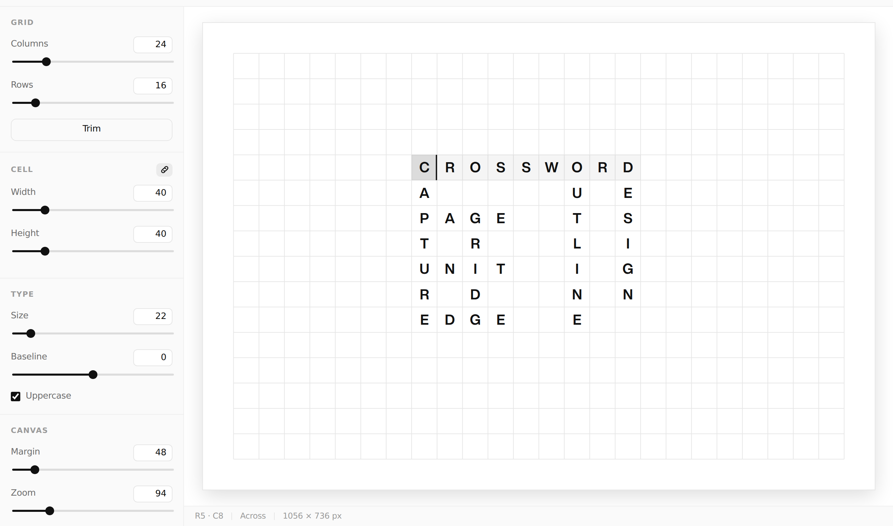

# Crossword — layout tool

A grid-based type tool for building crossword-style lettering. Letters sit
one to a cell, optically centred in an invisible block, so words interlock the
way they do in a printed crossword.

Static site — no build step, no dependencies, no framework.



## The typography

The grid is set in **Helvetica Now Display Bold**, loaded as WOFF2.

Centring is done on the font's **cap height** (712/1000 em), not on the em box
and not with `dominant-baseline`. A capital therefore sits dead centre in its
cell, and a row of them reads as one even band — which is the whole visual
premise. Browsers disagree about `dominant-baseline`, so the baseline is
computed rather than delegated:

```
baseline = cellTop + cellHeight / 2 + (0.712 × fontSize) / 2 + baselineShift
```

`Baseline shift` in the Type panel nudges that figure when a layout wants to
sit a touch high or low.

## Controls

| Panel | What it does |
| --- | --- |
| **Grid** | Columns and rows. Shrinking hides letters rather than deleting them — pull the slider back out and they return. *Trim to content* crops the grid to the letters and discards anything left outside. |
| **Cell** | Cell width and height, linked by default. Unlink for the wide-set look of the reference layouts, where horizontal spacing exceeds the line spacing. |
| **Type** | Font size, baseline shift, force uppercase. |
| **Colour** | Letter colour and ground. Picking a colour recolours the current selection; with nothing selected it sets the colour for what you type next. |
| **Canvas** | Margin around the grid, zoom, guide visibility, crossword clue numbers. |

Every numeric control is a slider *and* a number field bound to the same value
— scrub for feel, type for an exact figure.

## Typing

| Key | Action |
| --- | --- |
| Click | Place the cursor; click the same cell again to flip direction |
| <kbd>Tab</kbd> / <kbd>Enter</kbd> | Flip between across and down |
| Arrows | Move; the direction follows the axis |
| <kbd>Space</kbd> | Clear the cell and step forward |
| <kbd>Backspace</kbd> | Step back and clear |
| Drag / <kbd>Shift</kbd>+click | Select a block of cells |
| <kbd>Cmd/Ctrl</kbd>+<kbd>V</kbd> | Paste a word, or a whole multi-line layout |
| <kbd>Cmd/Ctrl</kbd>+<kbd>Z</kbd> | Undo (<kbd>Shift</kbd> to redo) |
| <kbd>Cmd/Ctrl</kbd>+<kbd>S</kbd> / <kbd>E</kbd> | Save / Export |

Pasting multi-line text drops it in as a block and grows the grid to fit, so a
layout written in a text editor — one character per cell — imports directly.
The Text export writes that same format back out.

## Export

- **SVG, outlined** — letters become real paths, drawn from `fonts/glyphs.json`.
  Opens identically in Illustrator, Figma or a browser with nothing installed.
- **SVG, live text** — keeps the letters editable, with the WOFF2 embedded as a
  data URI.
- **PNG** — 1× to 8×, drawn straight onto a canvas so the raster matches the screen.
- **Text** — one character per cell.

Ground colour is honoured, or omitted entirely with *Transparent ground*.

Work is kept in `localStorage` as you go. **Save** and **Open** move a layout
between machines as JSON.

## Running it

```bash
npm run dev      # http://localhost:8080
```

Any static server will do — there is nothing to compile.

## Deploying to Cloudflare

This deploys as a **static-assets Worker** — no Worker script, just files.
`wrangler.toml` is what makes that work:

```toml
name = "artresidencymoident"
compatibility_date = "2026-08-05"

[assets]
directory = "./public"
```

Everything served lives in `public/`, and nothing else in the repo is uploaded.
That is the point: a build machine that runs an install step drops a
`node_modules` at the repo root, and wrangler's own `workerd` binary inside it
is 122 MiB — well past the 25 MiB per-asset ceiling.

**Workers Builds** (the Git integration) needs no changes from its defaults:

| Setting | Value |
| --- | --- |
| Build command | *(leave empty)* |
| Deploy command | `npx wrangler deploy` |

There is nothing to compile, so the build command stays empty. The deploy
command is wrangler's default and reads the assets directory from the config.

**From your own machine**, as an alternative to the Git integration:

```bash
npm run deploy   # npx wrangler deploy
```

### If this is a Pages project instead

Pages and Workers take different config keys and wrangler infers the project
type from whichever it finds — they cannot both be present. For Pages, swap the
`[assets]` block for:

```toml
pages_build_output_dir = "public"
```

and deploy with `wrangler pages deploy`. Pages has no deploy-command field; it
uploads the build output directory itself, so leave its build command empty
too.

`public/_headers` sets the cache policy — a year on the font, an hour on CSS
and JS — plus `nosniff`, `SAMEORIGIN` and a referrer policy. Both products
honour it.

## Layout of the source

```
public/                 everything that gets deployed
  index.html            markup and the control panel
  css/app.css           design tokens and chrome
  js/state.js           the document, undo history, persistence
  js/render.js          SVG drawing and grid geometry
  js/input.js           pointer, keyboard, clipboard
  js/controls.js        sidebar bindings
  js/exporters.js       SVG / PNG / text
  fonts/                WOFF2 + extracted glyph outlines
  _headers              cache and security headers
font-src/               the TTF the WOFF2 and outlines are built from
tools/extract-glyphs.py rebuilds both from that TTF
wrangler.toml           declares public/ as the assets directory
```

The document is deliberately small: grid dimensions plus a sparse map of
`"row:col" → { ch, color }`. Everything else is presentation.

`public/fonts/glyphs.json` holds SVG path data and advance widths for 125
glyphs (printable ASCII plus common typographic marks). It is only fetched when
you export outlines.

Both it and the WOFF2 are generated — drop a new TTF into `font-src/` and run:

```bash
pip install fonttools brotli
python3 tools/extract-glyphs.py
```

It prints the new font's cap-height ratio; if that differs from 0.712, update
`CAP_RATIO` in `public/js/state.js` to match or the optical centring will drift.

## Note on the font

This repo carries a licensed commercial typeface. The TTF sits in `font-src/`
and is *not* deployed, but the WOFF2 built from it is served to every visitor,
and outlined SVG exports carry the letterforms too. Check your licence covers
web embedding before putting this on a public domain.
